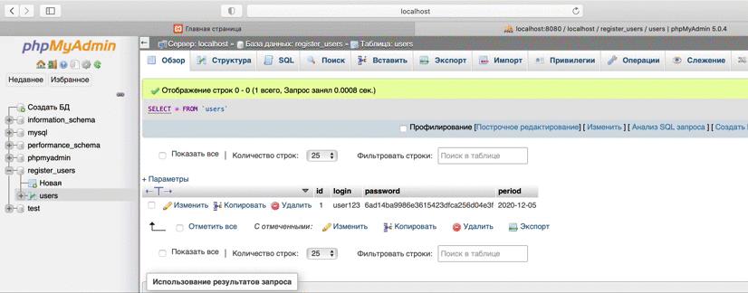

# Описание задания 

## Вариант 1 

Реализовать аутентификацию по паролю с хешированием MD5 (можно использовать функцию из библиотеки). В таблице идентификаторов должны храниться: логин, хеш пароля (md5), срок действия пароля. Таблица идентификаторов должна представлять собой таблицу в реляционной БД, данные должны передаваться через SQL-запросы. При истечении срока действия пароля аутентификация не должна проходить. При аутентификации на сервере сравниваются не пароли, а результаты MD5. 

# Демонстрация работы 

#### Проверка аутентификации

#### Проверка срока действия пароля

